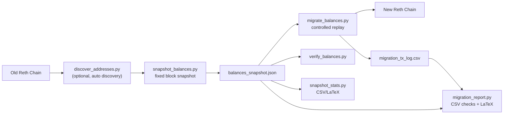

<div align="center">


[](https://git.io/typing-svg)

# 🧠✨ Reth PoS Balance Migration Toolkit

**Production-focused tooling for moving balances from an old private Reth chain to a new one, with reproducible evidence and offline reporting.**


</div>

> [!IMPORTANT]
> This repo migrates **balances only**. It does not carry transaction history, contract state migration logic, or app-level data migration.

## 🌈 What You Get
- 🧷 **Fixed-block snapshots** from old chain (`snapshot_balances.py`)
- 🚚 **Idempotent replay** of missing deltas onto new chain (`migrate_balances.py`)
- ✅ **Deterministic verification** against snapshot (`verify_balances.py`)
- 🧪 **Preflight safety checks** before replay (`preflight_check.py`)
- 🔍 **Automatic address discovery** with strict/proof modes (`discover_addresses.py`)
- 🧾 **Per-tx CSV audit logging** + offline consistency reporting (`migration_report.py`)
- 📊 **Distribution analytics** + CSV/LaTeX exports (`snapshot_stats.py`)

## 🗺️ Visual Flow


## ⚡ Super Quick Start (Copy/Paste)
### 1) Install
```bash
python3 -m venv .venv
source .venv/bin/activate
pip install -r requirements.txt
```

### 1.5) Enable Git Pre-Push Guard (Recommended)
This repo ships a strict `pre-push` hook in `.githooks/pre-push` to prevent accidental pushes to the wrong project/branch.

```bash
git config core.hooksPath .githooks
```

Guard behavior:
- only allows pushes to `origin` URL `https://github.com/SyedMuhamadYasir/reth_pos_migration.git`
- only allows branch pushes to `main` (tags are allowed)
- blocks push if local `main` is behind `origin/main`
- blocks remote ref deletions

### 2) Set env vars
```bash
export SOURCE_RPC_URL="http://old-node:8545"
export TARGET_RPC_URL="http://new-node:8545"
export ADMIN_PRIVATE_KEY="0x..."
export CHAIN_ID="4567"
```

### 3) Discover addresses (optional but recommended)
```bash
python scripts/discover_addresses.py \
  --out addresses_discovered.txt \
  --block 120000
```

### 4) Snapshot balances
```bash
python scripts/snapshot_balances.py \
  --addresses-file addresses_discovered.txt \
  --out balances_snapshot.json \
  --block 120000
```

### 5) Dry-run migration
```bash
python scripts/preflight_check.py \
  --snapshot balances_snapshot.json \
  --state-file migration_state.json \
  --exclude-addresses-file config/admin_skip_addresses_example.txt \
  --min-balance-wei 0 \
  --max-balance-wei 200000000000000000000000

python scripts/migrate_balances.py \
  --snapshot balances_snapshot.json \
  --state-file migration_state.json \
  --exclude-addresses-file config/admin_skip_addresses_example.txt \
  --max-balance-wei 200000000000000000000000 \
  --tx-log-csv logs/migration_tx_log.csv \
  --dry-run
```

### 6) Real migration
```bash
python scripts/migrate_balances.py \
  --snapshot balances_snapshot.json \
  --state-file migration_state.json \
  --exclude-addresses-file config/admin_skip_addresses_example.txt \
  --max-balance-wei 200000000000000000000000 \
  --tx-log-csv logs/migration_tx_log.csv
```

### 7) Verify + offline reports
```bash
python scripts/verify_balances.py --snapshot balances_snapshot.json

python scripts/snapshot_stats.py \
  --snapshot balances_snapshot.json \
  --csv-out stats/threshold_stats.csv \
  --tex-out stats/snapshot_stats.tex

python scripts/migration_report.py \
  --snapshot balances_snapshot.json \
  --tx-log-csv logs/migration_tx_log.csv \
  --tex-out stats/migration_report.tex
```

### Reth Operational Flow (Best-Effort, High Quality)
Use this exact flow when strict completeness is not available on your current Reth node.

```bash
# 1) Discover addresses with both heuristic methods
python scripts/discover_addresses.py --discovery-mode heuristic --method reth-balance-changes --from-block 0 --block 0x1d7aab --out addresses_reth.txt
python scripts/discover_addresses.py --discovery-mode heuristic --method tx-scan --from-block 0 --block 0x1d7aab --out addresses_txscan.txt

# 2) Union + dedupe
cat addresses_reth.txt addresses_txscan.txt \
  | grep -E '^0x[0-9a-fA-F]{40}$' \
  | tr '[:upper:]' '[:lower:]' \
  | sort -u > addresses_union.txt

# 3) Quick completeness sanity check
wc -l addresses_reth.txt addresses_txscan.txt addresses_union.txt

# 4) Snapshot from union list
# Optional: add --exclude-addresses-file config/admin_skip_addresses_example.txt
python scripts/snapshot_balances.py --addresses-file addresses_union.txt --out balances_snapshot.json --block 0x1d7aab

# 5) Safety upgrade: dry-run migration first
# Optional: add --exclude-addresses-file config/admin_skip_addresses_example.txt
# Optional: add --min-balance-wei / --max-balance-wei (must match preflight and verify)
python scripts/preflight_check.py --snapshot balances_snapshot.json --state-file migration_state.json
python scripts/migrate_balances.py --snapshot balances_snapshot.json --state-file migration_state.json --tx-log-csv logs/migration_tx_log.csv --dry-run

# 6) Real migration
# Optional: add --exclude-addresses-file config/admin_skip_addresses_example.txt
python scripts/migrate_balances.py --snapshot balances_snapshot.json --state-file migration_state.json --tx-log-csv logs/migration_tx_log.csv

# 7) Verification
# Optional: add --exclude-addresses-file config/admin_skip_addresses_example.txt
python scripts/verify_balances.py --snapshot balances_snapshot.json

# 8) Offline migration report (CSV consistency + LaTeX)
python scripts/migration_report.py --snapshot balances_snapshot.json --tx-log-csv logs/migration_tx_log.csv --tex-out stats/migration_report.tex
```

---

## 🧪 Full Audited Workflow (Recommended)

### Step 0: Address Discovery (Heuristic Mode)
```bash
python scripts/discover_addresses.py \
  --out addresses_discovered.txt \
  --block 120000 \
  --from-block 0
```

What it does:
- tries `reth_getBalanceChangesInBlock` first
- falls back to tx-scan if unsupported
- normalizes addresses
- filters to **EOAs only** (`eth_getCode == 0x`)
- filters zero-balance addresses (unless `--include-zero-balances`)

### Step 0B: Strict Discovery + Proof Gate
Use this when you need stronger provenance and supervisor-facing evidence.

```bash
python scripts/discover_addresses.py \
  --discovery-mode strict \
  --prove-preimages \
  --proof-sample-size 200 \
  --block 120000 \
  --out addresses_discovered.txt \
  --provenance-dir stats/discovery_provenance
```

Strict mode adds:
- `debug_accountRange` based discovery at one fixed block
- preimage completeness audit (fail hard on incomplete preimages)
- block metadata including `stateRoot`
- provenance artifacts (`manifest.json`, `checksums.sha256`, address lists)
- optional `eth_getProof` evidence (`--proof-sample-size` or `--proof-all`)

> [!WARNING]
> Strict completeness is only available if your RPC node returns real `debug_accountRange` page data.
> If your node returns `result: null` for `debug_accountRange`, formal strict completeness is not available on that node.
> In that case, use Step 0 heuristic discovery for operational migration, and run strict completeness on a separate audit node (commonly Geth archive + preimages).

### Step 1: Snapshot at Fixed Block
```bash
python scripts/snapshot_balances.py \
  --addresses-file addresses_discovered.txt \
  --out balances_snapshot.json \
  --block 120000
```

Tips:
- If `--block` is omitted, it resolves one fixed block via fallback tags (`finalized,safe,latest`)
- default behavior fails on snapshot RPC failures unless you explicitly pass `--allow-partial`

### Step 2: (Optional) Sum Required Funding
```bash
python scripts/migration_helper.py balances_snapshot.json
```

### Step 3: Prepare New Chain
- Create `genesis_new.json` with your new `chainId`
- fund admin wallet in genesis `alloc`
- boot new chain and confirm `TARGET_RPC_URL` is reachable

### Step 4: Preflight Checks (Recommended)
```bash
python scripts/preflight_check.py \
  --snapshot balances_snapshot.json \
  --state-file migration_state.json \
  --exclude-addresses-file config/admin_skip_addresses_example.txt \
  --min-balance-wei 0 \
  --max-balance-wei 200000000000000000000000
```

What preflight checks now enforce:
- required env vars are present (`TARGET_RPC_URL`, `ADMIN_PRIVATE_KEY`, `CHAIN_ID`; plus `SOURCE_RPC_URL` if probing source RPC)
- target/source RPC method probes succeed (`rpc_modules`, `eth_*`, `reth_getBalanceChangesInBlock`, `debug_accountRange`)
- snapshot has valid structure and fails if `failed_addresses` exist (unless `--allow-failed-snapshot`)
- state-file consistency with current run config (snapshot path, exclude file hash, min/max scope)

> [!IMPORTANT]
> `migrate_balances.py` now persists a run-config fingerprint in the state file.
> If you change snapshot path, exclusion file, or min/max scope, resume is blocked and you must use `--reset-state`.

### Step 5: Replay Balances
Dry run first:
```bash
python scripts/migrate_balances.py \
  --snapshot balances_snapshot.json \
  --state-file migration_state.json \
  --tx-log-csv logs/migration_tx_log.csv \
  --dry-run
```

Then execute:
```bash
python scripts/migrate_balances.py \
  --snapshot balances_snapshot.json \
  --state-file migration_state.json \
  --tx-log-csv logs/migration_tx_log.csv
```

Replay behavior:
- sends only missing `delta = expected - current`
- resumable via state file
- supports lower/upper scope gates:
  - `--min-balance-wei`
  - `--max-balance-wei`
- if either scope gate is set, migration intentionally becomes a partial-scope run
- state resume is guarded by run-config fingerprint (snapshot + exclude file + min/max)

### Step 6: Verify
```bash
python scripts/verify_balances.py \
  --snapshot balances_snapshot.json
```

Verification supports the same scope gates:
- `--min-balance-wei`
- `--max-balance-wei`

> [!NOTE]
> For full-scope verification, do not set `--min-balance-wei` or `--max-balance-wei`.
> If you do set them, the report is valid only for the selected scope.

### Step 7: Analytics + Paper Artifacts
Snapshot distribution stats:
```bash
python scripts/snapshot_stats.py \
  --snapshot balances_snapshot.json \
  --thresholds 1,10,100,1000,100000 \
  --less-than-eth 200000 \
  --csv-out stats/threshold_stats.csv \
  --tex-out stats/snapshot_stats.tex
```

Migration report (offline consistency + chain-of-custody hashes):
```bash
python scripts/migration_report.py \
  --snapshot balances_snapshot.json \
  --tx-log-csv logs/migration_tx_log.csv \
  --tex-out stats/migration_report.tex
```

---

## 🛡️ Excluding Admin/System Addresses
Use a shared skip file (example: `config/admin_skip_addresses_example.txt`) to keep out addresses handled separately by genesis `alloc`.

Address file format:
- one address per line
- `#` lines ignored
- blank lines ignored
- valid 20-byte `0x` address required

Snapshot:
```bash
python scripts/snapshot_balances.py \
  --addresses-file addresses_discovered.txt \
  --exclude-addresses-file config/admin_skip_addresses_example.txt \
  --out balances_snapshot.json \
  --block 120000
```

Migration:
```bash
python scripts/migrate_balances.py \
  --snapshot balances_snapshot.json \
  --exclude-addresses-file config/admin_skip_addresses_example.txt
```

Verification:
```bash
python scripts/verify_balances.py \
  --snapshot balances_snapshot.json \
  --exclude-addresses-file config/admin_skip_addresses_example.txt
```

> [!TIP]
> Use the same exclusion file across snapshot, migration, and verification. Mixing different exclusion sets creates audit ambiguity.
>
> [!TIP]
> If you change exclusion rules between migration runs, use `--reset-state` for clean resume semantics.

---

## 🧾 CSV + LaTeX Audit Outputs

### Migration Tx CSV (`--tx-log-csv`)
Each confirmed tx row includes:
- snapshot block number/tag/hash
- snapshot chain ID
- address + expected balance + current before + delta sent
- admin nonce/address
- tx hash + tx block number + gas fields + tx status

### LaTeX Fragments
- `snapshot_stats.py --tex-out ...` emits macros + threshold table
- `migration_report.py --tex-out ...` emits macros + summary table

You can include them in your paper:
```latex
\input{stats/snapshot_stats.tex}
\input{stats/migration_report.tex}
```

---

## 🧰 Script Cheat Sheet
| Script | Purpose | Online/Offline |
|---|---|---|
| `scripts/discover_addresses.py` | Discover candidate EOAs, strict proofs/provenance | Online (RPC) |
| `scripts/snapshot_balances.py` | Fixed-block snapshot to `balances_snapshot.json` | Online (RPC) |
| `scripts/preflight_check.py` | Preflight validation of env/RPC/snapshot/state consistency | Mixed (RPC + local files) |
| `scripts/migrate_balances.py` | Idempotent replay to new chain + optional tx CSV log | Online (RPC) |
| `scripts/verify_balances.py` | Compare new chain balances to snapshot | Online (RPC) |
| `scripts/snapshot_stats.py` | Distribution analytics + CSV/LaTeX | Offline |
| `scripts/migration_report.py` | Snapshot+txlog consistency checks + LaTeX | Offline |
| `scripts/migration_helper.py` | Quick balance sum utility | Offline |

---

## 📁 Repository Layout
```text
reth_pos_migration/
  README.md
  requirements.txt
  .gitignore

  .githooks/
    pre-push

  scripts/
    discover_addresses.py
    snapshot_balances.py
    preflight_check.py
    migrate_balances.py
    verify_balances.py
    snapshot_stats.py
    migration_report.py
    migration_helper.py

  examples/
    addresses_example.txt
    balances_snapshot_example.json

  config/
    admin_skip_addresses_example.txt

  genesis/
    README.md
```

---

## ✅ Safety Checklist Before Real Migration
- [ ] `CHAIN_ID` env matches target network chain ID
- [ ] admin wallet has enough balance for transfer value + gas
- [ ] snapshot block is fixed and documented
- [ ] exclusion file reviewed and intentional
- [ ] dry-run output looks sane
- [ ] tx CSV logging enabled (`--tx-log-csv`)
- [ ] post-run verification completed
- [ ] offline reports generated and archived

---

## 🧯 Troubleshooting
<details>
<summary><b>Snapshot fails on some addresses</b></summary>

Use a clean, validated address list and stable source RPC. Default behavior exits non-zero if any address fails. Use `--allow-partial` only when intentional.
</details>

<details>
<summary><b>Migration stopped mid-run</b></summary>

Re-run with the same snapshot and state file. The script resumes safely and reconciles in-flight tx when possible.
</details>

<details>
<summary><b>Need to limit migration scope</b></summary>

Use `--min-balance-wei` and/or `--max-balance-wei` on both migration and verification scripts.
</details>

<details>
<summary><b>Proof-grade discovery claims</b></summary>

Use strict mode with `--prove-preimages`, persist provenance bundle, and optionally collect `eth_getProof` artifacts (`--proof-sample-size` or `--proof-all`). This requires `debug_accountRange` to return real page data (not `null`).
</details>

---

<div align="center">

### 💖 Built for high-stakes private chain migrations

If you want, the next upgrade can be a one-command orchestrator (`make migrate-audit`) that runs discovery → snapshot → migrate → verify → reports end-to-end.

</div>
