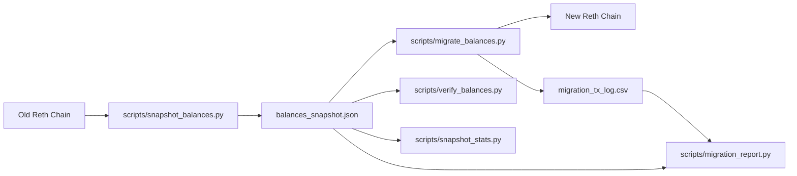

<div align="center">

# 🚀 Reth PoS Balance Migration Toolkit

Migration-grade tooling for moving account balances from an old Reth private chain to a new one.


</div>

> [!IMPORTANT]
> This toolkit is designed for **balance migration only**.
> It preserves addresses and balances, not historical transactions.

## ✨ Why This Exists
When rebuilding a private PoS network, you often want a clean chain with a new `chainId` while preserving user balances. This repo gives you a practical, auditable workflow:
- Snapshot balances at one fixed source block.
- Replay balances from an admin wallet on the new chain.
- Verify final balances match exactly.
- Analyze distribution and concentration offline for reporting.

## 🧭 End-to-End Flow


## 📦 Repository Layout
```text
reth_pos_migration/
  README.md
  requirements.txt
  .gitignore

  scripts/
    discover_addresses.py          # automatic candidate-address discovery from old chain
    snapshot_balances.py           # deterministic snapshot from old chain
    migrate_balances.py            # replay balances to new chain from admin wallet
    verify_balances.py             # verify new chain balances match snapshot
    migration_report.py            # offline summary + LaTeX report from migration tx log
    migration_helper.py            # utility: sum/check snapshot totals
    snapshot_stats.py              # offline analytics + optional CSV/LaTeX exports

  examples/
    addresses_example.txt
    balances_snapshot_example.json

  genesis/
    README.md                      # genesis file guidance (old/new)

  config/
    admin_skip_addresses_example.txt # sample admin/system addresses to exclude
```

## ⚙️ Requirements
- Python `3.10+`
- Install dependencies:

```bash
pip install -r requirements.txt
```

## 🔐 Environment Variables
```bash
export SOURCE_RPC_URL="http://old-node:8545"   # snapshot_balances.py
export TARGET_RPC_URL="http://new-node:8545"   # migrate_balances.py / verify_balances.py
export ADMIN_PRIVATE_KEY="0x..."               # admin wallet on NEW chain
export CHAIN_ID="4567"                         # NEW chainId (decimal)
```

## 🚀 Quick Start
### 0) (Optional) Auto-discover addresses on old chain
```bash
python scripts/discover_addresses.py \
  --out addresses_discovered.txt \
  --block 120000
```

Then use the generated file for snapshot:
```bash
python scripts/snapshot_balances.py \
  --addresses-file addresses_discovered.txt \
  --out balances_snapshot.json \
  --block 120000
```

Notes:
- Default mode tries `reth_getBalanceChangesInBlock` and falls back to tx-scan if needed.
- It keeps EOAs only (`eth_getCode == 0x` at target block), filtering out contracts/apps.
- By default it filters out zero-balance accounts at target block.
- You can still apply skip filters via `--exclude-addresses-file`.

For proof-oriented, full-account discovery (with preimage completeness gate + provenance bundle):
```bash
python scripts/discover_addresses.py \
  --discovery-mode strict \
  --prove-preimages \
  --proof-sample-size 200 \
  --block 120000 \
  --out addresses_discovered.txt \
  --provenance-dir stats/discovery_provenance
```

Strict mode uses `debug_accountRange` at one fixed block, fails if preimages are incomplete, records block `stateRoot`, and writes auditable artifacts (`manifest.json`, `checksums.sha256`, address snapshots, and optional `eth_getProof` evidence).

`eth_getProof` options:
- `--proof-sample-size N`: collect proofs for first `N` final addresses (deterministic sorted order).
- `--proof-all`: collect proofs for all final addresses.

### 1) Snapshot balances from old chain
```bash
python scripts/snapshot_balances.py \
  --addresses-file examples/addresses_example.txt \
  --out balances_snapshot.json \
  --block 120000
```

If `--block` is omitted, the script resolves one fixed block from fallback tags (`finalized,safe,latest`) and still snapshots consistently at that pinned block.

### 2) Prepare and start new chain
- Build `genesis_new.json` with your new `chainId`.
- Fund migration admin account in genesis `alloc`.
- Start execution/consensus nodes and validate RPC health.

### 3) Replay balances (dry-run first)
```bash
python scripts/migrate_balances.py \
  --snapshot balances_snapshot.json \
  --tx-log-csv logs/migration_tx_log.csv \
  --dry-run

python scripts/migrate_balances.py \
  --snapshot balances_snapshot.json \
  --state-file migration_state.json \
  --tx-log-csv logs/migration_tx_log.csv
```

### 4) Verify migrated balances
```bash
python scripts/verify_balances.py \
  --snapshot balances_snapshot.json
```

## 🧾 Migration Audit Logging
Use `--tx-log-csv` with `migrate_balances.py` to append a machine-readable per-transaction audit trail.

Each row captures snapshot metadata and tx execution details, including recipient address, expected/current balances, delta sent, nonce, tx hash, tx block number, gas fields, and status.

Example:
```bash
python scripts/migrate_balances.py \
  --snapshot balances_snapshot.json \
  --state-file migration_state.json \
  --tx-log-csv logs/migration_tx_log.csv
```

The CSV is append-safe for resumable runs: existing files are reused, and header duplication is avoided.

## 🛡️ Exclude Admin/System Addresses
Use `--exclude-addresses-file` when certain addresses are out-of-scope for replay (for example: admin reserves, system contracts, genesis-funded alloc buckets).

Address file format:
- one address per line
- `#` comment lines ignored
- blank lines ignored
- address must be valid `0x` 20-byte hex

Sample file: `config/admin_skip_addresses_example.txt`

Snapshot with exclusions:
```bash
python scripts/snapshot_balances.py \
  --addresses-file examples/addresses_example.txt \
  --exclude-addresses-file config/admin_skip_addresses_example.txt \
  --out balances_snapshot.json \
  --block 120000
```

Migration with exclusions:
```bash
python scripts/migrate_balances.py \
  --snapshot balances_snapshot.json \
  --exclude-addresses-file config/admin_skip_addresses_example.txt \
  --state-file migration_state.json
```

Verification with exclusions:
```bash
python scripts/verify_balances.py \
  --snapshot balances_snapshot.json \
  --exclude-addresses-file config/admin_skip_addresses_example.txt
```

Semantics:
- `snapshot_balances.py`: excluded addresses are removed from output snapshot and counted in `address_counts.excluded`.
- `migrate_balances.py`: excluded addresses are skipped (no tx sent), counted in summary.
- `verify_balances.py`: excluded addresses are skipped in validation, counted in summary.

> [!TIP]
> If you change the exclude file between migration runs, use `--reset-state` in `migrate_balances.py`.

## 📊 Offline Analytics and Reporting
`snapshot_stats.py` is fully offline and never talks to RPC:

```bash
python scripts/snapshot_stats.py \
  --snapshot balances_snapshot.json \
  --thresholds 1,10,100,1000 \
  --csv-out stats/threshold_stats.csv \
  --tex-out stats/snapshot_stats.tex
```

Outputs:
- human-readable stdout report
- optional threshold CSV (`--csv-out`)
- optional LaTeX fragment for papers (`--tex-out`, via `\input{...}`)

## 📝 Migration Report Generator
`migration_report.py` is an offline consistency and reporting tool for the migration phase.

```bash
python scripts/migration_report.py \
  --snapshot balances_snapshot.json \
  --tx-log-csv logs/migration_tx_log.csv \
  --tex-out stats/migration_report.tex
```

It:
- validates internal consistency between snapshot metadata and tx log rows
- checks per-row invariants (`current_balance_before_wei + delta_sent_wei == expected_balance_wei`)
- computes SHA256 chain-of-custody hashes for both snapshot JSON and tx log CSV
- prints a concise summary to stdout
- can emit a LaTeX fragment for paper/report workflows

## ✅ Safety and Correctness Notes
- Snapshot uses a fixed resolved block (`eth_getBlockByNumber`) to avoid moving-head inconsistency.
- RPC failures are recorded in `failed_addresses`; default behavior is non-zero exit unless `--allow-partial`.
- Migration is resumable with state tracking and in-flight reconciliation.
- Admin private key is never printed.
- Excluded addresses are never migrated/verified and should be handled separately (for example via genesis `alloc`).

## 🧪 Utility Command
Quickly compute total required balance from snapshot:
```bash
python scripts/migration_helper.py balances_snapshot.json
```
